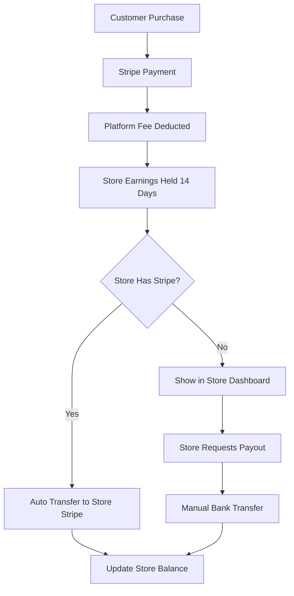

# 🏢 InterioWale Complete Multi-Tenant Marketplace & Admin Platform

## 🎯 **Vision: Transform InterioWale into a Multi-Tenant Marketplace**

Create a platform where multiple store owners can sell products through your marketplace, with commission-based revenue sharing, AI features, and comprehensive admin control.

**Think:** *Shopify + Amazon + AI Interior Design Platform*

---

## 🏗️ **Platform Architecture Overview**

### 🔑 **User Hierarchy & Roles:**

```
👑 SUPREME ADMIN (You)
├── 🏪 STORE OWNER 1
│   ├── 👨💼 STORE MANAGER 1
│   ├── 👨💼 STORE MANAGER 2
│   ├── 📦 EMPLOYEE (Inventory)
│   └── 🚚 EMPLOYEE (Fulfillment)
├── 🏪 STORE OWNER 2
│   ├── 👨💼 STORE MANAGER 1
│   └── 📦 EMPLOYEE (Inventory)
└── 🏪 STORE OWNER N...
```

### 💰 **Revenue Flow:**

```
Customer Purchase ($100)
↓
Platform Fee (You): $10 (10% commission)
↓
Store Owner: $90
↓
After 14 days → Transfer to Store Owner's Bank
```

---

## 🎭 **Role-Based Access Control (RBAC)**

### 👑 **Supreme Admin (You)**
**Full Platform Control**

```typescript
interface SupremeAdminPermissions {
  stores: {
    create: true;
    read: true;
    update: true;
    delete: true;
    suspend: true;
  };
  users: {
    createStoreOwner: true;
    viewAllUsers: true;
    banUsers: true;
    impersonate: true;
  };
  finance: {
    setCommissionRates: true;
    viewAllTransactions: true;
    processPayout: true;
    holdPayments: true;
  };
  ai: {
    manageCredits: true;
    setAIPricing: true;
    viewAllAIUsage: true;
  };
  platform: {
    systemSettings: true;
    analytics: true;
    reports: true;
  };
}
```

### 🏪 **Store Owner**
**Complete Store Control**

```typescript
interface StoreOwnerPermissions {
  store: {
    update: true; // Their store only
    brandingSettings: true;
    storeSettings: true;
  };
  products: {
    create: true;
    read: true; // Their products only
    update: true;
    delete: true;
  };
  orders: {
    read: true; // Their orders only
    updateStatus: true;
    processRefunds: true;
  };
  team: {
    inviteEmployees: true;
    manageRoles: true;
    viewTeamActivity: true;
  };
  finance: {
    viewEarnings: true;
    requestPayout: true;
    addStripeAccount: true;
    viewTransactions: true; // Their transactions only
  };
  ai: {
    buyCredits: true; // For their customers
    viewAIUsage: true; // Their store's AI usage
  };
}
```

### 👨💼 **Store Manager**
**Operational Management**

```typescript
interface StoreManagerPermissions {
  products: {
    create: true;
    read: true;
    update: true;
    delete: false; // Cannot delete
  };
  orders: {
    read: true;
    updateStatus: true;
    processRefunds: false; // Cannot refund
  };
  inventory: {
    updateStock: true;
    lowStockAlerts: true;
  };
  customers: {
    read: true;
    communicate: true;
  };
  reports: {
    salesReports: true;
    inventoryReports: true;
  };
}
```

---

## 💰 **Commission & Payment System**

### 🎯 **Commission Structure:**

```typescript
interface CommissionSettings {
  globalCommissionRate: number; // Default 10%
  categoryCommissionRates: {
    [categoryId: string]: number; // Different rates per category
  };
  storeCommissionRates: {
    [storeId: string]: number; // Custom rates per store
  };
  volumeDiscounts: {
    threshold: number; // Monthly sales volume
    discountRate: number; // Reduced commission
  }[];
}
```

### 💳 **Payment Processing Flow:**



---

## 🏪 **Store Management System**

### 🏬 **Store Entity:**

```typescript
interface Store {
  id: string;
  name: string;
  slug: string; // URL: /stores/awesome-plants
  description: string;
  logo?: string;
  banner?: string;
  
  owner: {
    userId: string;
    name: string;
    email: string;
  };
  
  settings: {
    isActive: boolean;
    isApproved: boolean;
    commissionRate: number;
    categories: string[]; // Allowed categories
    
    branding: {
      primaryColor: string;
      secondaryColor: string;
      customCSS?: string;
    };
    
    shipping: {
      freeShippingThreshold?: number;
      shippingRates: ShippingRate[];
    };
  };
  
  financials: {
    stripeAccountId?: string;
    totalEarnings: number;
    pendingEarnings: number;
    lastPayoutDate?: Date;
  };
  
  stats: {
    totalProducts: number;
    totalOrders: number;
    monthlyRevenue: number;
    rating: number;
    reviewCount: number;
  };
  
  createdAt: Date;
  updatedAt: Date;
}
```

---

## 🎛️ **Complete Admin Dashboard System**

### 📊 **1. Main Dashboard (Overview)**

#### Key Metrics Cards:
- 💰 **Total Revenue** (today, week, month)
- 🛒 **Total Orders** (pending, completed, cancelled)
- 👥 **Active Users** (new, returning, total)
- 🤖 **AI Usage** (credits used, revenue from AI)
- 🏪 **Active Stores** (total, new applications)
- 💳 **Commission Earned** (platform revenue)

#### Recent Activity Feed:
- New store applications
- New orders placed
- User registrations
- AI designs generated
- Payment notifications
- Store payouts processed

#### Performance Charts:
- Platform revenue trends
- Store performance comparison
- User growth across stores
- AI usage patterns
- Commission earnings by category

### 👥 **2. User Management**

```typescript
interface User {
  id: string;
  name: string;
  email: string;
  role: 'customer' | 'store_owner' | 'store_manager' | 'employee';
  storeId?: string; // If associated with a store
  registeredAt: Date;
  lastLogin?: Date;
  status: 'active' | 'inactive' | 'banned';
  totalOrders: number;
  totalSpent: number;
  aiCreditsUsed: number;
}
```

#### Features:
- 🔍 **Search & Filter** by role, store, status
- 🏪 **Store Association** - see which store users belong to
- 📊 **Cross-Store Analytics** - user behavior across stores
- 💬 **Platform Communication** - send platform-wide notifications
- 🔒 **Role Management** - assign store roles, permissions

### 🏪 **3. Store Management**

#### Store Applications:
- 📝 **Application Review** - approve/reject new stores
- 📋 **Document Verification** - business licenses, tax IDs
- ✅ **Onboarding Process** - guide new stores through setup
- 🎯 **Store Categories** - assign allowed product categories

#### Active Stores:
- 📊 **Store Performance** - revenue, orders, growth
- ⚙️ **Store Settings** - commission rates, permissions
- 🎨 **Branding Control** - approve store customizations
- 💰 **Financial Management** - earnings, payouts, holds

### 🛒 **4. Order Management (Cross-Store)**

```typescript
interface PlatformOrder {
  id: string;
  storeId: string;
  storeName: string;
  customerInfo: CustomerInfo;
  items: OrderItem[];
  amounts: {
    subtotal: number;
    platformFee: number;
    storeEarnings: number;
    total: number;
  };
  status: OrderStatus;
  paymentStatus: PaymentStatus;
  orderDate: Date;
}
```

#### Features:
- 📋 **All Orders View** - orders from all stores
- 🏪 **Store Filter** - filter by specific stores
- 💰 **Commission Tracking** - platform fees per order
- 📊 **Order Analytics** - cross-store performance
- 🚨 **Dispute Management** - handle order issues

### 🤖 **5. AI Management (Platform-Wide)**

#### AI Analytics:
- 📈 **Platform AI Usage** - total generations across all stores
- 💰 **AI Revenue** - credit sales by store
- 💸 **Cost Analysis** - Replicate costs vs. platform revenue
- 🏪 **Store AI Performance** - which stores use AI most
- 🎨 **Popular Styles** - trending design preferences

#### Credit Management:
```typescript
interface PlatformCreditAnalytics {
  totalCreditsSold: number;
  totalCreditsUsed: number;
  revenueFromCredits: number;
  replicateCosts: number;
  profitMargin: number;
  creditsByStore: {
    [storeId: string]: {
      sold: number;
      used: number;
      revenue: number;
    };
  };
}
```

### 📦 **6. Product Management (Cross-Store)**

#### Platform Product Control:
- 📋 **All Products View** - products from all stores
- 🏷️ **Category Management** - platform-wide categories
- 🚫 **Content Moderation** - approve/reject products
- 📊 **Product Analytics** - best sellers across stores
- 🔍 **SEO Management** - platform search optimization

### 💰 **7. Financial Analytics (Platform)**

#### Revenue Dashboard:
- 📈 **Platform Revenue** - total commission earned
- 🏪 **Revenue by Store** - top performing stores
- 💳 **Payment Processing** - Stripe fees, success rates
- 📊 **Profit Analysis** - platform costs vs. revenue
- 🌍 **Geographic Analysis** - revenue by location

#### Payout Management:
- 💸 **Pending Payouts** - stores awaiting payment
- 🏦 **Payout History** - completed transfers
- 🚨 **Hold Management** - freeze payments if needed
- 📊 **Payout Analytics** - average payout amounts, frequency

---

## 📊 **Dashboard Hierarchy**

### 👑 **Supreme Admin Dashboard (`/admin`)**

```
🏠 Platform Overview
├── 📊 Platform Analytics
├── 🏪 Store Management
│   ├── Store Applications
│   ├── Active Stores
│   └── Store Performance
├── 👥 All Users (Cross-Store)
├── 💰 Financial Overview
│   ├── Commission Tracking
│   ├── Payout Management
│   └── Revenue Analytics
├── 🛒 All Orders (Cross-Store)
├── 📦 All Products (Cross-Store)
├── 🤖 AI Platform Management
│   ├── Platform AI Analytics
│   ├── Credit Management
│   └── AI Cost Tracking
└── ⚙️ Platform Settings
```

### 🏪 **Store Owner Dashboard (`/store/dashboard`)**

```
🏪 My Store Overview
├── 📊 Store Analytics
├── 📦 My Products
├── 🛒 My Orders
├── 👥 My Team
├── 💰 My Earnings
│   ├── Revenue Dashboard
│   ├── Commission Details
│   └── Payout Requests
├── 🤖 AI for My Customers
├── 🎨 Store Customization
└── ⚙️ Store Settings
```

---

## 🏗️ **Technical Architecture**

### Frontend Structure:
```
/app/
├── admin/                     # Supreme Admin Dashboard
│   ├── layout.tsx            # Admin layout with sidebar
│   ├── page.tsx              # Platform overview
│   ├── stores/
│   │   ├── page.tsx          # Store management
│   │   ├── applications/     # Store applications
│   │   └── [id]/            # Individual store details
│   ├── users/               # Cross-store user management
│   ├── orders/              # Cross-store order management
│   ├── products/            # Cross-store product management
│   ├── ai/                  # Platform AI management
│   └── analytics/           # Platform analytics
├── store/                   # Store Owner/Manager Dashboard
│   ├── dashboard/           # Store dashboard
│   ├── products/            # Store products
│   ├── orders/              # Store orders
│   ├── team/                # Team management
│   ├── earnings/            # Financial dashboard
│   └── settings/            # Store settings
└── (client)/                # Customer-facing pages
```

### Database Schema Extensions:

```typescript
// Store schema
export const storeSchema = {
  name: 'store',
  type: 'document',
  fields: [
    { name: 'name', type: 'string' },
    { name: 'slug', type: 'slug' },
    { name: 'owner', type: 'reference', to: [{ type: 'user' }] },
    { name: 'settings', type: 'storeSettings' },
    { name: 'financials', type: 'storeFinancials' },
    { name: 'status', type: 'string' }, // active, pending, suspended
  ]
};

// Enhanced product schema
export const productSchema = {
  name: 'product',
  type: 'document',
  fields: [
    // Existing fields...
    { name: 'store', type: 'reference', to: [{ type: 'store' }] },
    { name: 'commissionRate', type: 'number' },
    { name: 'isApproved', type: 'boolean' },
  ]
};

// Enhanced order schema  
export const orderSchema = {
  name: 'order',
  type: 'document',
  fields: [
    // Existing fields...
    { name: 'store', type: 'reference', to: [{ type: 'store' }] },
    { name: 'platformFee', type: 'number' },
    { name: 'storeEarnings', type: 'number' },
    { name: 'payoutStatus', type: 'string' },
  ]
};

// User roles schema
export const userRoleSchema = {
  name: 'userRole',
  type: 'document',
  fields: [
    { name: 'user', type: 'reference', to: [{ type: 'user' }] },
    { name: 'store', type: 'reference', to: [{ type: 'store' }] },
    { name: 'role', type: 'string' },
    { name: 'permissions', type: 'array', of: [{ type: 'string' }] },
  ]
};

// Transaction tracking
export const transactionSchema = {
  name: 'transaction',
  type: 'document',
  fields: [
    { name: 'order', type: 'reference', to: [{ type: 'order' }] },
    { name: 'store', type: 'reference', to: [{ type: 'store' }] },
    { name: 'amounts', type: 'transactionAmounts' },
    { name: 'status', type: 'string' },
    { name: 'dates', type: 'transactionDates' },
  ]
};

// Store applications
export const storeApplicationSchema = {
  name: 'storeApplication',
  type: 'document',
  fields: [
    { name: 'applicantInfo', type: 'applicantInfo' },
    { name: 'businessInfo', type: 'businessInfo' },
    { name: 'storeInfo', type: 'storeInfo' },
    { name: 'documents', type: 'array', of: [{ type: 'file' }] },
    { name: 'status', type: 'string' },
    { name: 'reviewNotes', type: 'text' },
  ]
};
```

---

## 🚀 **Implementation Phases**

### **Phase 1: Multi-Tenant Foundation (Weeks 1-2)**
- ✅ Multi-tenant authentication system
- ✅ Role-based access control (RBAC)
- ✅ Store entity and basic CRUD
- ✅ Enhanced Sanity schemas
- ✅ Basic admin dashboard layout

### **Phase 2: Store Management (Weeks 3-4)**
- 🏪 Store application and approval system
- 👥 Team management (invite employees)
- 📦 Store-specific product management  
- 🛒 Store-specific order management
- 💰 Basic commission calculation

### **Phase 3: Admin Dashboard Core (Weeks 5-6)**
- 📊 Platform analytics dashboard
- 👥 Cross-store user management
- 🛒 Cross-store order management
- 🏪 Store performance monitoring
- 💰 Commission tracking system

### **Phase 4: Financial System (Weeks 7-8)**
- 💳 Advanced commission calculation
- 🏦 Payout request and processing
- 📊 Financial dashboards for all roles
- ⏰ 14-day hold system
- 🔗 Stripe Connect integration

### **Phase 5: AI Platform Management (Weeks 9-10)**
- 🤖 Platform-wide AI analytics
- 💰 AI credit management per store
- 📊 AI cost tracking and ROI
- 🎨 AI content moderation
- 📈 AI performance metrics

### **Phase 6: Advanced Features (Weeks 11-12)**
- 🎨 Store customization and branding
- 📱 Mobile-responsive dashboards
- 🔔 Notification systems
- 📊 Advanced analytics and reporting
- 🛡️ Enhanced security features

### **Phase 7: Polish & Launch (Weeks 13-14)**
- 🧪 Comprehensive testing
- 📚 Documentation and training
- 🎨 UI/UX polish
- 🚀 Production deployment
- 👥 First store onboarding

---

## 💰 **Revenue Projections**

### **Year 1 Goals:**

| Metric | Month 3 | Month 6 | Month 12 |
|--------|---------|---------|----------|
| **Stores** | 10 | 25 | 50 |
| **Monthly GMV** | $50K | $150K | $500K |
| **Commission Revenue** | $5K | $15K | $50K |
| **AI Revenue** | $2K | $8K | $20K |
| **Total Platform Revenue** | $7K | $23K | $70K |

### **Commission Strategy:**
- **New Stores**: 12% commission (higher to fund growth)
- **Established Stores**: 10% commission (standard rate)
- **High Volume**: 8% commission ($50K+ monthly)
- **Premium Partnership**: 6% commission (exclusive stores)

---

## 🛡️ **Security & Access Control**

### Platform Security:
- 🔐 **Multi-factor Authentication** for all admin accounts
- 📝 **Activity Logging** - all admin and store actions logged
- 🚫 **IP Restrictions** - limit admin access by IP
- ⏰ **Session Management** - automatic logout
- 🔑 **API Key Management** - secure API access per store
- 🛡️ **Data Isolation** - stores can only access their own data

### Row Level Security (RLS):
```typescript
// Middleware to ensure users only see their store's data
export async function enforceStoreAccess(
  userId: string, 
  requestedStoreId?: string
): Promise<string[]> {
  const userRoles = await getUserRoles(userId);
  
  // Supreme admin sees all stores
  if (userRoles.includes('supreme_admin')) {
    return await getAllStoreIds();
  }
  
  // Return only stores this user has access to
  return userRoles
    .filter(role => role.storeId)
    .map(role => role.storeId);
}
```

---

## 📋 **Getting Started Checklist**

### **Immediate Actions:**
1. ✅ **Review the complete plan** and confirm scope
2. ✅ **Choose starting phase** (recommend Phase 1)
3. ✅ **Set up development timeline**
4. ✅ **Identify first beta store owners**
5. ✅ **Plan commission structure**

### **Technical Setup:**
1. 🔧 **Extend Sanity schemas** for multi-tenancy
2. 🛡️ **Implement RBAC system**
3. 🏪 **Create store management APIs**
4. 💰 **Set up commission tracking**
5. 📊 **Build admin dashboard foundation**

---

This comprehensive plan transforms InterioWale into a powerful multi-tenant marketplace with complete admin control, where you earn commission from every sale while providing AI-powered interior design services across multiple stores! 🚀

**Ready to start implementation?** I recommend beginning with:
1. **🔐 Multi-tenant authentication & RBAC**
2. **🏪 Basic store management system**  
3. **👑 Supreme admin dashboard foundation**
4. **💰 Commission calculation system**