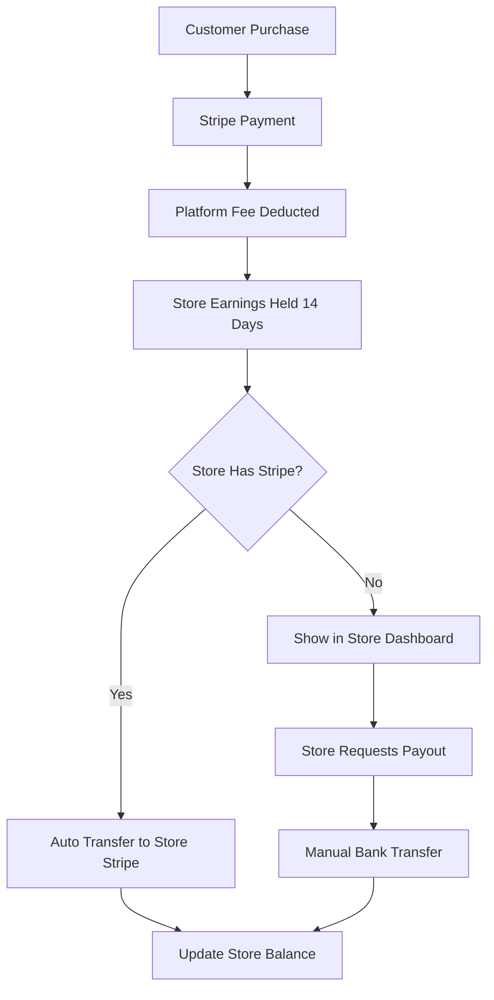

# 🏢 InterioWale Multi-Tenant Marketplace Platform Plan

## 🎯 **Vision: Transform InterioWale into a Multi-Tenant Marketplace**

Create a platform where multiple store owners can sell products through your marketplace, with commission-based revenue sharing, AI features, and comprehensive role-based access control.

**Think:** *Shopify + Amazon + AI Interior Design Platform*

---

## 🏗️ **Platform Architecture Overview**

### 🔑 **User Hierarchy & Roles:**

```
👑 SUPREME ADMIN (You)
├── 🏪 STORE OWNER 1
│   ├── 👨‍💼 STORE MANAGER 1
│   ├── 👨‍💼 STORE MANAGER 2
│   ├── 📦 EMPLOYEE (Inventory)
│   └── 🚚 EMPLOYEE (Fulfillment)
├── 🏪 STORE OWNER 2
│   ├── 👨‍💼 STORE MANAGER 1
│   └── 📦 EMPLOYEE (Inventory)
└── 🏪 STORE OWNER N...
```

### 💰 **Revenue Flow:**

```
Customer Purchase ($100)
↓
Platform Fee (You): $10 (10% commission)
↓
Store Owner: $90
↓
After 14 days → Transfer to Store Owner's Bank
```

---

## 🎭 **Role-Based Access Control (RBAC)**

### 👑 **Supreme Admin (You)**
**Full Platform Control**

```typescript
interface SupremeAdminPermissions {
  stores: {
    create: true;
    read: true;
    update: true;
    delete: true;
    suspend: true;
  };
  users: {
    createStoreOwner: true;
    viewAllUsers: true;
    banUsers: true;
    impersonate: true;
  };
  finance: {
    setCommissionRates: true;
    viewAllTransactions: true;
    processPayout: true;
    holdPayments: true;
  };
  ai: {
    manageCredits: true;
    setAIPricing: true;
    viewAllAIUsage: true;
  };
  platform: {
    systemSettings: true;
    analytics: true;
    reports: true;
  };
}
```

**Supreme Admin Dashboard Features:**
- 🏪 **Store Management** - Create, manage, suspend stores
- 💰 **Commission Settings** - Set different rates per store/category
- 📊 **Platform Analytics** - Total revenue, growth, top stores
- 👥 **User Management** - All users across all stores
- 💳 **Payment Management** - Process payouts, hold funds
- 🤖 **AI Platform Control** - Manage AI credits, pricing
- ⚙️ **System Settings** - Platform configurations

### 🏪 **Store Owner**
**Complete Store Control**

```typescript
interface StoreOwnerPermissions {
  store: {
    update: true; // Their store only
    brandingSettings: true;
    storeSettings: true;
  };
  products: {
    create: true;
    read: true; // Their products only
    update: true;
    delete: true;
  };
  orders: {
    read: true; // Their orders only
    updateStatus: true;
    processRefunds: true;
  };
  team: {
    inviteEmployees: true;
    manageRoles: true;
    viewTeamActivity: true;
  };
  finance: {
    viewEarnings: true;
    requestPayout: true;
    addStripeAccount: true;
    viewTransactions: true; // Their transactions only
  };
  ai: {
    buyCredits: true; // For their customers
    viewAIUsage: true; // Their store's AI usage
  };
}
```

**Store Owner Dashboard Features:**
- 📊 **Store Analytics** - Sales, orders, customers
- 📦 **Product Management** - Add, edit, inventory
- 🛒 **Order Management** - Fulfillment, tracking
- 👥 **Team Management** - Hire employees, assign roles
- 💰 **Earnings Dashboard** - Revenue, pending payouts
- 🎨 **Store Customization** - Branding, themes
- 🤖 **AI Features** - Offer AI to their customers

### 👨‍💼 **Store Manager**
**Operational Management**

```typescript
interface StoreManagerPermissions {
  products: {
    create: true;
    read: true;
    update: true;
    delete: false; // Cannot delete
  };
  orders: {
    read: true;
    updateStatus: true;
    processRefunds: false; // Cannot refund
  };
  inventory: {
    updateStock: true;
    lowStockAlerts: true;
  };
  customers: {
    read: true;
    communicate: true;
  };
  reports: {
    salesReports: true;
    inventoryReports: true;
  };
}
```

### 📦 **Employee (Inventory)**
**Product & Inventory Focus**

```typescript
interface InventoryEmployeePermissions {
  products: {
    create: true;
    read: true;
    update: true; // Inventory fields only
  };
  inventory: {
    updateStock: true;
    receiveShipments: true;
    stockAlerts: true;
  };
  orders: {
    read: true; // View only
  };
}
```

### 🚚 **Employee (Fulfillment)**
**Order Processing Focus**

```typescript
interface FulfillmentEmployeePermissions {
  orders: {
    read: true;
    updateStatus: true; // Processing, shipped, delivered
    printLabels: true;
    scanTracking: true;
  };
  inventory: {
    read: true; // View stock levels
    reserveItems: true;
  };
}
```

---

## 💰 **Commission & Payment System**

### 🎯 **Commission Structure:**

```typescript
interface CommissionSettings {
  globalCommissionRate: number; // Default 10%
  categoryCommissionRates: {
    [categoryId: string]: number; // Different rates per category
  };
  storeCommissionRates: {
    [storeId: string]: number; // Custom rates per store
  };
  volumeDiscounts: {
    threshold: number; // Monthly sales volume
    discountRate: number; // Reduced commission
  }[];
}

// Example:
const commissionExample = {
  globalCommissionRate: 0.10, // 10%
  categoryCommissionRates: {
    "plants": 0.08, // 8% for plants
    "furniture": 0.12, // 12% for furniture
    "ai-credits": 0.15, // 15% for AI credits
  },
  storeCommissionRates: {
    "premium-store-id": 0.07, // VIP store gets 7%
  },
  volumeDiscounts: [
    { threshold: 10000, discountRate: 0.09 }, // $10k+ gets 9%
    { threshold: 50000, discountRate: 0.08 }, // $50k+ gets 8%
  ]
};
```

### 💳 **Payment Processing Flow:**



### 📊 **Financial Tracking:**

```typescript
interface Transaction {
  id: string;
  orderId: string;
  storeId: string;
  customerId: string;
  
  amounts: {
    orderTotal: number;
    platformFee: number;
    storeEarnings: number;
    processingFee: number;
  };
  
  status: 'pending' | 'held' | 'released' | 'paid_out';
  
  dates: {
    orderDate: Date;
    releaseDate: Date; // 14 days after order
    paidOutDate?: Date;
  };
  
  paymentMethod: 'stripe_auto' | 'manual_transfer' | 'pending_request';
}
```

### 💵 **Payout Management:**

```typescript
interface PayoutRequest {
  id: string;
  storeId: string;
  requestedAmount: number;
  availableAmount: number;
  status: 'pending' | 'approved' | 'rejected' | 'paid';
  requestDate: Date;
  bankDetails: {
    accountNumber: string;
    routingNumber: string;
    accountHolderName: string;
  };
  notes?: string;
}
```

---

## 🏪 **Store Management System**

### 🏬 **Store Entity:**

```typescript
interface Store {
  id: string;
  name: string;
  slug: string; // URL: /stores/awesome-plants
  description: string;
  logo?: string;
  banner?: string;
  
  owner: {
    userId: string;
    name: string;
    email: string;
  };
  
  settings: {
    isActive: boolean;
    isApproved: boolean;
    commissionRate: number;
    categories: string[]; // Allowed categories
    
    branding: {
      primaryColor: string;
      secondaryColor: string;
      customCSS?: string;
    };
    
    shipping: {
      freeShippingThreshold?: number;
      shippingRates: ShippingRate[];
    };
  };
  
  financials: {
    stripeAccountId?: string;
    totalEarnings: number;
    pendingEarnings: number;
    lastPayoutDate?: Date;
  };
  
  stats: {
    totalProducts: number;
    totalOrders: number;
    monthlyRevenue: number;
    rating: number;
    reviewCount: number;
  };
  
  createdAt: Date;
  updatedAt: Date;
}
```

### 🎨 **Store Customization:**

Each store gets:
- **Custom Store Page**: `/stores/[store-slug]`
- **Branded Product Pages**: Store branding on product pages
- **Custom Domain Support**: `store-name.interiowale.com`
- **Store Analytics**: Dedicated analytics for each store

---

## 📊 **Dashboard Hierarchy**

### 👑 **Supreme Admin Dashboard (`/admin`)**

```
🏠 Overview
├── 📊 Platform Analytics
├── 🏪 Store Management
├── 👥 All Users
├── 💰 Financial Overview
├── 🛒 All Orders
├── 📦 All Products
├── 🤖 AI Platform Management
├── ⚙️ System Settings
└── 🔧 Developer Tools
```

**Key Features:**
- **Platform Revenue**: Total commission earned
- **Store Performance**: Top/bottom performing stores
- **User Growth**: Platform-wide user metrics
- **Commission Management**: Set rates, approve changes
- **Payout Queue**: Pending payout requests
- **AI Revenue**: Credits sold across all stores

### 🏪 **Store Owner Dashboard (`/store/dashboard`)**

```
🏪 My Store Overview
├── 📊 Store Analytics
├── 📦 My Products
├── 🛒 My Orders
├── 👥 My Team
├── 💰 My Earnings
├── 🤖 AI for My Customers
├── 🎨 Store Customization
└── ⚙️ Store Settings
```

**Key Features:**
- **Store Revenue**: Earnings after commission
- **Product Performance**: Best/worst sellers
- **Order Management**: Fulfillment pipeline
- **Team Management**: Employee roles and permissions
- **Payout Requests**: Request money transfers
- **AI Credits**: Sell AI services to customers

### 👨‍💼 **Store Manager Dashboard (`/store/manager`)**

```
📊 Store Operations
├── 📦 Products (Limited)
├── 🛒 Orders (Process Only)
├── 📋 Inventory
├── 👥 Customers
└── 📊 Reports
```

### 📦 **Employee Dashboard (`/store/employee`)**

```
🔧 My Tasks
├── 📦 Inventory (if inventory role)
├── 🚚 Orders (if fulfillment role)
├── 📊 My Performance
└── 📋 Task Queue
```

---

## 🏪 **Store Onboarding Process**

### 📝 **Store Application:**

```typescript
interface StoreApplication {
  applicantInfo: {
    name: string;
    email: string;
    phone: string;
    businessName: string;
    businessType: 'individual' | 'llc' | 'corporation';
  };
  
  storeInfo: {
    storeName: string;
    description: string;
    categories: string[];
    expectedMonthlyVolume: number;
  };
  
  verification: {
    businessLicense?: File;
    taxId?: string;
    bankStatements?: File[];
  };
  
  status: 'pending' | 'approved' | 'rejected';
}
```

### ✅ **Approval Process:**

1. **Application Review** (Supreme Admin)
2. **Document Verification**
3. **Store Setup** (Name, branding, categories)
4. **Test Product Upload**
5. **Go Live** 🚀

---

## 💻 **Technical Implementation**

### 🗄️ **Database Schema (Sanity)**

```typescript
// Enhanced schemas for multi-tenancy

// Store schema
export const storeSchema = {
  name: 'store',
  type: 'document',
  fields: [
    { name: 'name', type: 'string' },
    { name: 'slug', type: 'slug' },
    { name: 'owner', type: 'reference', to: [{ type: 'user' }] },
    { name: 'settings', type: 'storeSettings' },
    { name: 'financials', type: 'storeFinancials' },
    // ... more fields
  ]
};

// Enhanced product schema
export const productSchema = {
  name: 'product',
  type: 'document',
  fields: [
    // Existing fields...
    { name: 'store', type: 'reference', to: [{ type: 'store' }] },
    { name: 'commissionRate', type: 'number' },
    // ... more fields
  ]
};

// Enhanced order schema  
export const orderSchema = {
  name: 'order',
  type: 'document',
  fields: [
    // Existing fields...
    { name: 'store', type: 'reference', to: [{ type: 'store' }] },
    { name: 'platformFee', type: 'number' },
    { name: 'storeEarnings', type: 'number' },
    // ... more fields
  ]
};

// User roles schema
export const userRoleSchema = {
  name: 'userRole',
  type: 'document',
  fields: [
    { name: 'user', type: 'reference', to: [{ type: 'user' }] },
    { name: 'store', type: 'reference', to: [{ type: 'store' }] },
    { name: 'role', type: 'string' }, // 'owner', 'manager', 'employee_inventory', etc.
    { name: 'permissions', type: 'array', of: [{ type: 'string' }] },
  ]
};

// Transaction tracking
export const transactionSchema = {
  name: 'transaction',
  type: 'document',
  fields: [
    { name: 'order', type: 'reference', to: [{ type: 'order' }] },
    { name: 'store', type: 'reference', to: [{ type: 'store' }] },
    { name: 'amounts', type: 'transactionAmounts' },
    { name: 'status', type: 'string' },
    { name: 'dates', type: 'transactionDates' },
  ]
};
```

### 🛡️ **Row Level Security (RLS)**

```typescript
// Middleware to ensure users only see their store's data
export async function enforceStoreAccess(
  userId: string, 
  requestedStoreId?: string
): Promise<string[]> {
  const userRoles = await getUserRoles(userId);
  
  // Supreme admin sees all stores
  if (userRoles.includes('supreme_admin')) {
    return await getAllStoreIds();
  }
  
  // Return only stores this user has access to
  return userRoles
    .filter(role => role.storeId)
    .map(role => role.storeId);
}
```

### 🔐 **API Security:**

```typescript
// Example API route with store access control
export async function GET(request: NextRequest) {
  const { userId } = await auth();
  const { storeId } = await request.json();
  
  // Check if user has access to this store
  const allowedStores = await enforceStoreAccess(userId, storeId);
  
  if (!allowedStores.includes(storeId)) {
    return NextResponse.json({ error: 'Forbidden' }, { status: 403 });
  }
  
  // Proceed with request...
}
```

---

## 🚀 **Implementation Phases**

### **Phase 1: Foundation (Weeks 1-2)**
- ✅ Multi-tenant authentication system
- ✅ Role-based access control (RBAC)
- ✅ Store entity and basic CRUD
- ✅ Enhanced Sanity schemas
- ✅ Basic store owner dashboard

### **Phase 2: Core Multi-Tenancy (Weeks 3-4)**
- 🏪 Store application and approval system
- 👥 Team management (invite employees)
- 📦 Store-specific product management  
- 🛒 Store-specific order management
- 💰 Basic commission calculation

### **Phase 3: Financial System (Weeks 5-6)**
- 💳 Commission tracking and calculation
- 🏦 Payout request system
- 📊 Financial dashboards for all roles
- ⏰ 14-day hold system
- 🔗 Stripe Connect integration

### **Phase 4: Advanced Features (Weeks 7-8)**
- 🎨 Store customization and branding
- 📊 Advanced analytics per store
- 🤖 AI credits per store
- 📱 Mobile-responsive dashboards
- 🔔 Notification systems

### **Phase 5: Polish & Launch (Weeks 9-10)**
- 🧪 Comprehensive testing
- 📚 Documentation and training
- 🎨 UI/UX polish
- 🚀 Production deployment
- 👥 First store onboarding

---

## 💰 **Revenue Projections**

### **Year 1 Goals:**

| Metric | Month 3 | Month 6 | Month 12 |
|--------|---------|---------|----------|
| **Stores** | 10 | 25 | 50 |
| **Monthly GMV** | $50K | $150K | $500K |
| **Commission Revenue** | $5K | $15K | $50K |
| **AI Revenue** | $2K | $8K | $20K |
| **Total Revenue** | $7K | $23K | $70K |

### **Commission Strategy:**
- **New Stores**: 12% commission (higher to fund growth)
- **Established Stores**: 10% commission (standard rate)
- **High Volume**: 8% commission ($50K+ monthly)
- **Premium Partnership**: 6% commission (exclusive stores)

---

## 📋 **Getting Started Checklist**

### **Immediate Actions:**

1. ✅ **Review the plan** and confirm scope
2. ✅ **Choose starting phase** (recommend Phase 1)
3. ✅ **Set up development timeline**
4. ✅ **Identify first beta store owners**
5. ✅ **Plan commission structure**

### **Technical Setup:**

1. 🔧 **Extend Sanity schemas** for multi-tenancy
2. 🛡️ **Implement RBAC system**
3. 🏪 **Create store management APIs**
4. 💰 **Set up commission tracking**
5. 📊 **Build role-specific dashboards**

---

Would you like me to start implementing any specific part of this plan? I recommend starting with:

1. **🔐 Multi-tenant authentication & RBAC**
2. **🏪 Basic store management system**  
3. **👑 Supreme admin dashboard**
4. **💰 Commission calculation system**

This plan will transform InterioWale into a powerful multi-tenant marketplace where you earn commission from every sale while providing AI-powered interior design services! 🚀